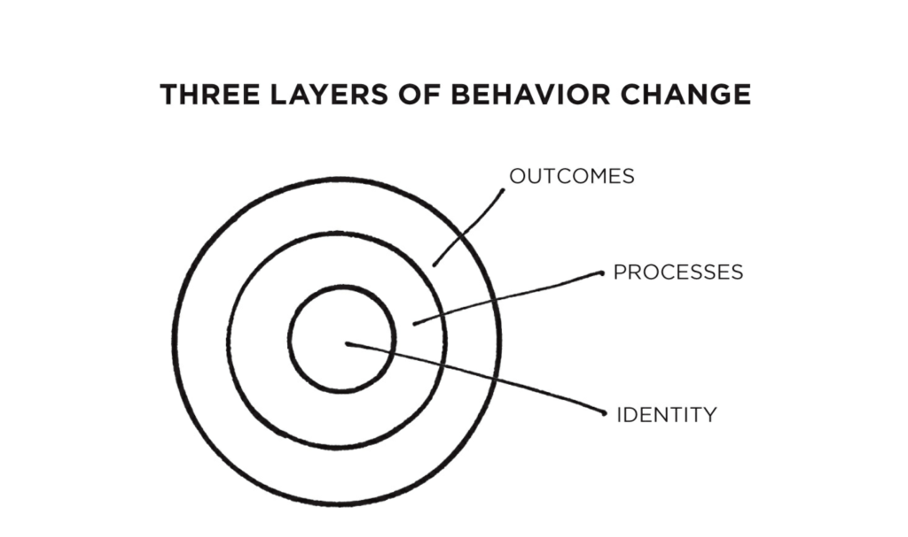
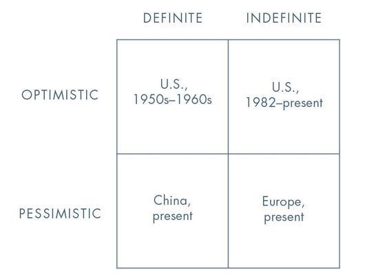

## The Millionaire Next Door - Thomas Stanley and William Danko
* Common denominators among those who successfully build wealth:
  * Live below their means
  * Allocate time, money, and energy, in ways conducive to building wealth
  * Financial independence is more important than displaying high social status
  * Parents do not provide economic outpatient care
  * Their adult children are economically self-sufficient
  * Proficient in targeting market opportunities
  * Chose the right occupation
  
* **Wealthy (Definition)**: One who gets more pleasure from owning substantial amounts of appreciable assets than from displaying a high-consumption lifestyle

* **Expected Net worth** = (Age x Pretax annual income / 10)

* Great offense: Earn High; Great Defense: Accumulate High (Frugal)

  The way to outperform is through great defense, and this is possible through budgeting and planning (time and energy).

* **Strategy for nunbudgeter millionaires**: Create an environment of relative scarcity i.e invest from their annual before they pay the sellers for their food, clothes, home, credit, etc.

* To build wealth, minimize your realized (taxable) income, and maximize your unrealized income (wealth / capital appreciation without a cash flow)

* Never purchase a home with a mortgage that is more than 2x your household's annual realized income

* Begin earning and investing early in your adult life

* Wealth is more often the result of a lifestyle of hard work, perseverance, planning, and, most of all, self-discipline

* Choose a financial advisor who is endorsed by an enlightened accountant and/or his clients with investment portfolios that in the long run outpace the market. If you don’t have an accountant, hire one. To find a high-quality accountant, ask friends or associates who fit the PAW profile. You may wish to call the accounting department at your state’s university. Speak with several accounting faculty. Ask them for the names of their former students who have established track records in helping clients make enlightened financial decisions. Another method is to call the local offices of national accounting firms, which are often very selective in their hiring. Even large firms have many smaller accounting/financial planning clients. We selected our CPAs based on two criteria. First, the CPAs were recommended by professors of accounting. Second, the CPAs were initially hired out of college by major accounting firms and later started their own successful accounting firms. We find that many of the very best CPAs and financial planners follow this career path.

## The Happiness Advantage - Shawn Achor

* Cultivating positive brains makses us more motivated, efficient, resilient, creative, and productive, which drives performance upward

* If we study merely what is average, we will remain merely average. Don't make the error of the average i.e don't always try and get to the average. This links to not removing the outliers, and rather learn from them.

* What we spend our time and mental energy focusing on can indeed become our reality

* Brains are hardwired to perform at their best not when they are negative or neutral, but when they are positive

* Seven principles that predict success and achievement
  * **The Happiness Advantage**: Positive brains have more biological advantage over negative or neutral brains
  
  * **The Fulcrum and the Lever**: The way we experience the world, and the ability to succeed in it changes based on our         mindset. This principle teaches us how we can adjust our mindset (fulcrum) in a way that gives us the power (lever) to be     more fulfilled and successful.
  
  * **The Tetris Effect**: When our brain gets stuck in a pattern that focuses on stress, negativity, and failure, we set     
    ourselves to fail. This principle teaches us how to retrain our brains to spot patters of posibility, so we can seize the
    opportunities around us.
    
  * **Falling Up**: This principle is about finding the mental path that not only leads us up out of failure or suffering, 
    but teaches us to be happier and more successful because of it.
     
  * **The Zorro Circle**: When challenges loom and we get overwhelmed, our rational brains can get hijacked by emotions. This
    principle teaches us how to regain control by focusing first on small, manageable goals, and then gradually expanding our
    circles to achieve bigger and bigger ones.
     
  * **The 20-second Rule**: Sustaining lasting change often feels impossible since our willpower is limited. When our 
    willpower fails, we fall back to out old habits, and succumb to the path of least resistance. This principle shows, how
    by making small energy adjustments, we can reroute the path of least resistance and replace bad habits with good ones.
     
  * **Social Investment**: In the midst of challenges and stress, we choose to hunker down and retreat within ourselves. 
    However, the most successful people invest in their friends, peers and family members to propel themselves forward. This 
    principle teaches us how to invest more in one of the greates predictors of success and excellence - our social support 
    network.

* Happiness is not a belief that we don't need to change, it is the realization that we can

* Don't look at happiness as some distant reward for achievements. Rather, capitalize on the positive and reap the rewards at 
  every turn.
  
* Happiness is the joy we feel striving after our potential
 
* Positive emotions flood our brains with dopamine and serotonin, chemicals that not only make us feel good, but dial up the 
  learning centers of our brains to higher levels. It helps us organize new information, keep that info in the brain longer,
  and retrieve it faster
   
* **Medical anchoring**: Occurs when a doctor has trouble letting go of an initial diagonosis (anchor point), even in the 
  face of new information that contradicts the initial theory.
  
* Positive emotions provide a quick and powerful antidote to stress and anxiety, which in turn improves our focus and our 
  ability to function at the best level.
  
* **Some ways to put yourself in a positive mindset**:
  * Meditate
  * Find something to look forward to
  * Commit conscious acts of kindness
  * Infuse positivity in your surroundings
  * Exercise
  * Spend money on doing and not having
  * Exercise a signature strength
  
* Sacrificing positivity in the name of time management and efficiency actually slows us down

* **Some ways to spread positive mindset**:
  * Talk about someone in the company who deserves recognition (Basically words of appreciation make a huge difference)
  * A small token of appreciation from one person to another
  
* The mental contruction of our faily activities, more than the activity itself, defines our reality

* Believe in your abilities, and focus on your strengths when assigned a challenging task

* Scanning the world for negatives undercuts our creativity, raises our stress levels, and lowers the motivation and ability
  to accomplish goals
  
* Perform the *Three Good Things* Exercise daily

* **Counterfact**: An alternate scenario our brain creates to help us evaluate and make sense of what really happened

* Learn the ABCD (Adversity, Belief, Consequence, Disputation)

* Activation energy is the initial spark needed to catalyze a reaction. The same energy, both physical and mental is needed 
  of people to overcome inertia and kick-start a positive habit. Otherwise, we end up going down on a path of least  
  resistance.
  
* Lower the activation energy for the habits that you want to adobt, and raise it for the ones you want to avoid. The more we 
  lower the activation energy for our desired actions, the more we enhance our ability to jump-start positive change.
  
* Studies show that the more team members are encouraged to socialize and interact face-to-face, the more engaged they feel, 
  the more energy they have, and the longer they can stay focused on a task.
  
## Atomic Habits - James Clear

* A habit is a routine or a behavior performed regularly, and in many cases automatically

* Changes that seem small and unimportant at first will compound into remarkable results when you stick with them for years

* You get what you repeat

* Time magnifies the margin between success and failure. It will multiply whatever you feed it. Good habits make time your 
  ally. Bad habits make time your enemy.
  
* Habits need to persist long enough to break the Plateau of Latent Potential, in which the initial growth is very slow, and 
  once you cross the threshold, you see remarkable results.
  
* Goals are about the results you want to achieve. Systems are the processes that lead to those results.

* Goals are good for setting a direction. Systems are good for making progress.

* Fix the inputs and the outputs will fix themselves

* The purpose of goals is to win the game. The purpose of systems is to keep playing the game. True long-term thinking is 
  goal-less thinking. It is a cycle of endless refinement and continuous improvement.
  
* You do not rise to the level of your goals. You fall to the level of your systems.

* Changing habits is challenging because:
  * We try to change the wrong thing
  * We try to change our habits in the wrong way

* Outcomes are about what you get. Processes are about what you do. Identity is about what you believe.
  
* Improvements are only temporary until they become a part of who you are i.e of your identity.

* Progress requires unlearning. Becoming the best version requires you to edit your beliefs, and to upgrade and expand your  
  identity.
  
* New identities require new evidence. It is a 2-step process:
  * Decide the type of person you want to be
  * Prove it to yourself with small wins
  
* Habits are not about having something. They are about becoming someone.

* Habits do not restrict freedom. They create it. Habits get done automatically, and gives us more mental space to focus on new challenges.

* Hearing your bad habits spoken aloud make the consequences seem more real.

* Best way to start a new habit:
  * Implementation intention: Plan you make beforehand about when and where to act. (With a particular time and location)
  * Habit stacking: Identify a current habit you do each day, and then stack your new behavior on top of it. (With a  
    particular current habit)

## Zero to One - Peter Theil

* Horizontal progress (Globalization): Copying things that work.

* Vertical progress (Technology): Doing new things.

* In a world of scarce resources, globalization without new technology is unsustainable.

* A startup is the largest group of people you can convince of a plan to build a different future.

* Startups operate on the principle that you need to work with other people to get stuff done, but you also need to stay small enough so that you actually can.

* What a startup needs to do? - Question received ideas and rethink business from scratch.

* First step to thinking clearly is to question what we think we know about the past.

* Some principles that might work:
  * Better to risk boldness than triiviality.
  * A bad plan is better than no plan.
  * Competitive markets destroy profits.
  * Sales matters just as much as product.
  
* Don't ignore the dogmas of the past. Think about the past mistakes and think for yourself.

* If you want to create and capture lasting value, don't build an undifferentiated commodity business.

* Competitive firms try to showcase themselves as a monopoly (Try to define their market as **intersection** of smaller markets).
  Monpolists try to showcase themselves as being in competition to avoid scrutinization (Try to frame their market as **union** of several markets).
  
* Creative monopolists give customers more choices by adding entirely new categories of abundance to the world. The are not just good for society; the are powerful 
  engines for making it better.

* Monopoly is the condition for a successful business. All happy companies are different; Each have a monopoly by solving a unique problem. All failed companies
  are the same; they failed to escape competition.
  
* A great tech busiiness iis defined by its ability to generate cash flows in the future.

* Characteristics of Monopoly:
  * **Proprietary Technology**: It must be atleast 10x better than its closest substitute in some important dimension. The clearest way to make > 10x improvement
    is to invent something completely new.
  * **Network Effects**: It makes a product more useful as more people use it. Start small and then scale. The perfect target market for a startup is a small
    group of people concentrated together and served by few or no competitors. Post this, expand into related and slightly broader markets. As you craft a plan 
    to adjacent markets, don't disrupt: avoid competition as much as possible.
  * **Economies of Scale**: Fixed costs of creating a product can be spread out over greater quantities of sales.
  * **Branding**

* A definite view favors firm convictions. Instead of pursuing many-sided mediocrity, a definite person decides the one best thing to do and then does it.
**Definite Optimism**: Envision and do it.
**Definite Pessimism**: Copy without expecting anything new.
**Indefinite Pessimism**: Self-fulfilling; Slacker with low expectations.
**Indefinite Optimism**: Some progress without planning.

* To increase discretionary spending, we would need definite plans to solve specific problems.

* In startups, intelligent design works best.

* Lean way of starting is a methodology, not a goal. Making small changes to things that already exist might lead to a local maximum, not a global maximum.

* **The Power Law**: A small handful of companies radically outperform all others. If you focus on diversification instead of pursuit of the very few companies that can become overwhelmingly valuable, you will miss out on those rare companies in the first place.
  * Only invest in companies that have the potential to return the value of the entire fund. This is scary because it eliminates the vast majority of possible
    investments.
  * The one who understands the power law will make as few investments as possible (Diversification is not always a strength)
  
* **Secrets**: There still are hidden problems that we need to identify, and solve. If there are many secrets, there are many world changing companies yet to be 
  started.
    * Four social trends have made us root out our belief in secrets:
      * Incrementalism: We tend to do only a bit incremental work on top of already existing work.
      * Risk Aversion: The prospect of taking the risk and being lonely but right is scary. The prospect of being lonely and wrong is unbearable.
      * Compacency: We try to reap the benefits of the past.
      * Flatness: With globalization, we think that everyone has access to everything. If it were possible to discover something new, someone in some corner
        of the world has already done it.
        
    * To say there are no secrets left would mean that we live in a world with no hidden injustice. Slavery was once considered normal until it was identified 
      as an injustice.
      
    * In economics, disbileif in screts leads to faith in efficient markets. However, this leads to a bubble and ultimately the market crashes.
    
    * There are many more secrets, and will yield to only relentless searchers.
    
    * Two kinds of secrets: **Secrets of nature** and **Secrets about people** +
      When thinking of what kind of company to build, ask yourself:
      1. What secrets is nature not telling you?
      2. What secrets are people not telling you?
  
* **Foundations**:

  * Technical abilities and compelmentary skill sets of co-founders matter, but how well they work together matter just as much. They should have a prehistory 
    before they start a company together.
    
  * Useful to distinguish between:
    * Ownership (Who legally owns a company's equity?): In a startup, usually the founders, employees, and investors.
    * Possession (Who actually runs the company on a day-to-day basis?): In a startup, it is the employees.
    * Control (Who formally governs the company's affairs?): In a startup, usually the Board of Directors comprising of founders and investors.
    
  * If you want an effective board, keep it small. For a private company, a board of three is ideal. It should never exceed five. For public companies, the average
    is nine members.
    
  * For a venture backed startup, a low pay CEO is what is desired. Any cash is more about short term (present) rather than long term (future). This is because
    once we have cash in hand, we can do anything at that moment, and don't try to create new value for the company in the future.
    
  * The most valuable kind of company maintains an openness to invention that is most characteristic of its beginnings. Keep being born by creating new things.
  
* If you want someone to join your company, tell them about your mission and team.

* Superior sales and distributiion by itself can create a monopoly, even with no product differentiation. However, the opposite is not true.

* Humans and Computers together could achieve better than either of them alone.

* Seven questions that every company must answer:
  * The Engineering Question: Can you create breakthrough technology instead of incremental improvements?
  * The Timing Question: Is now the right time to start your particular business?
  * The Monopoly Question: Are you starting with a big share of a small market?
  * The People Question: Do you have the right team?
  * The Distribution Question: Do you have a way to not just create but to deliver the product?
  * The Durability Question: Will your market position be defensible 10 and 20 years into the future?
  * The Secret Question: Have you identified a unique opportunity that others don't see?
  
* An entrepreneur can't benefit from macro-scale insights unless his own plans begin at the micro-scale.

* Start small. Become big in a small market, and then scale.

* Four possible patterns for future of humanity:
  * Recurrent collapse: Alternation between prosperity and ruin (Ups and Downs).
  * Plateau: We were reach a plateau, and the future will be same as the present. (Stagnation can lead to extinction because of heavy competition).
  * Extinction: We will rise up and then fall so hard that we won't be able to recover.
  * Takeoff: Accelerating takeoff towards a much better future. The breakthrough could take a number of forms
